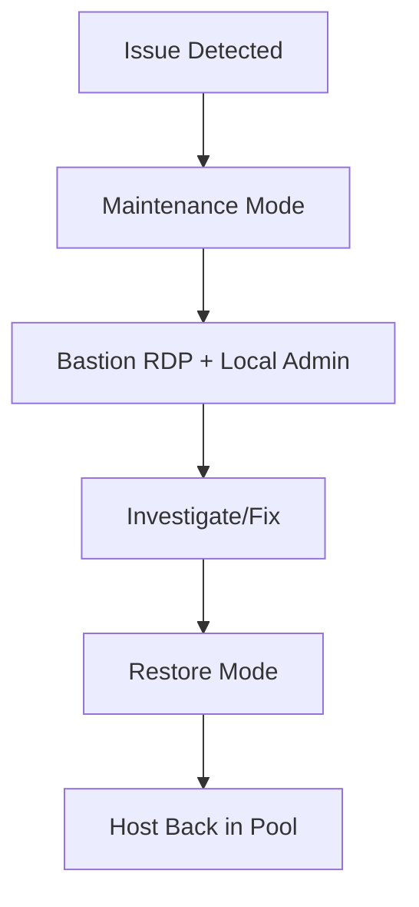

# AVD Troubleshooting Tools

This folder contains operational troubleshooting scripts for Azure Virtual Desktop session hosts.

## Overview

These tools help diagnose and remediate AVD session host issues through:
- **Maintenance mode**: Drain sessions, remove from pool, enable local admin access
- **Restore mode**: Re-configure AVD prerequisites, reinstall agent, re-register to host pool
- **Validation**: Check AVD prerequisites and report findings

## Files

- **`avd-troubleshoot.sh`**: Main troubleshooting orchestration (maintenance/restore workflows)
- **`scripts/validate-multisession-avd.ps1`**: Validates AVD prerequisites and reports configuration status

## Quick Start

### Maintenance Mode (Pull Host for Troubleshooting)

```bash
cd troubleshooting

./avd-troubleshoot.sh \
  --maintenance \
  --resource-group "avd-rg" \
  --vm-name "avd-sh-0"
```

**What it does:**
1. Drains active sessions (sets host to drain mode)
2. Removes host from pool registration
3. Enables local admin account
4. Relaxes RDP NLA for Bastion access
5. Disables FSLogix
6. Stops AVD services
7. Stores host pool info for restore

### Restore Mode (Return Host to Production)

```bash
./avd-troubleshoot.sh \
  --restore \
  --resource-group "avd-rg" \
  --vm-name "avd-sh-0"
```

**What it does:**
1. Retrieves new host pool registration token
2. Runs `configure-avd-image.ps1` via Run Command
3. Downloads and installs AVD agent + bootloader with token
4. Re-enables FSLogix
5. Verifies session host registration
6. Enables new sessions

### Validation Only

Run the validation script directly via Azure Run Command:

```bash
az vm run-command invoke \
  --resource-group "avd-rg" \
  --name "avd-sh-0" \
  --command-id RunPowerShellScript \
  --scripts @troubleshooting/scripts/validate-multisession-avd.ps1
```

## Workflow

### Typical Troubleshooting Flow



1. **Maintenance**: Pull the host safely
2. **Access**: Use Bastion with local admin
3. **Diagnose**: Check logs, services, configs
4. **Fix**: Apply manual fixes or script updates
5. **Restore**: Re-configure and re-register
6. **Verify**: Confirm sessions can connect

## Maintenance Mode Details

The maintenance workflow:
- Safely removes the host without disrupting active sessions
- Stores pool metadata in `/tmp/avd-pool-info-<vm>.json`
- Does NOT delete the VM (only deregisters it)

**Access the VM:**
```bash
# Via Azure Bastion (local admin enabled, NLA relaxed)
# Username: LocalAdmin (or your local admin account)
# Password: (your configured local admin password)
```

## Restore Mode Details

The restore workflow:
- Requires the host pool info from maintenance mode
- Gets a fresh registration token (valid for a limited time)
- Runs the full AVD configuration script
- Reinstalls AVD agent + bootloader
- Re-registers with the latest token

**Prerequisites:**
- VM must be running
- VM must have network access to AVD control plane
- Host pool must exist

## Validation Script

The `validate-multisession-avd.ps1` script checks:

| Category | Checks |
|----------|--------|
| **RDP Settings** | Multi-session mode, RDP timeouts |
| **FSLogix** | Profile container config, VHD locations |
| **Defender** | Exclusions for FSLogix paths |
| **Optimization** | CompactOS, page file, power settings |
| **AVD Agent** | Agent version, bootloader version |
| **Host Pool** | Registration status |

**Output**: Grouped results (PASS/WARN/FAIL) formatted for Azure Run Command.

## Integration with Image Builder

The troubleshooting scripts use the same `configure-avd-image.ps1` that's embedded in the image build pipeline, ensuring consistency between image builds and runtime remediation.

## Related Documentation

- [Image Builder Pipeline](../image-builder/README.md) - How images are built
- [Deployment Guide](../deployment/README.md) - Infrastructure deployment
- [Disk Sizing Guide](../docs/DISK-SIZING-GUIDE.md) - Ephemeral OS disk considerations
